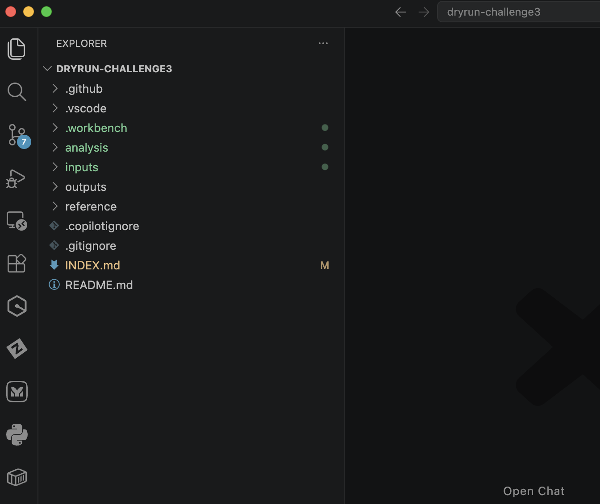
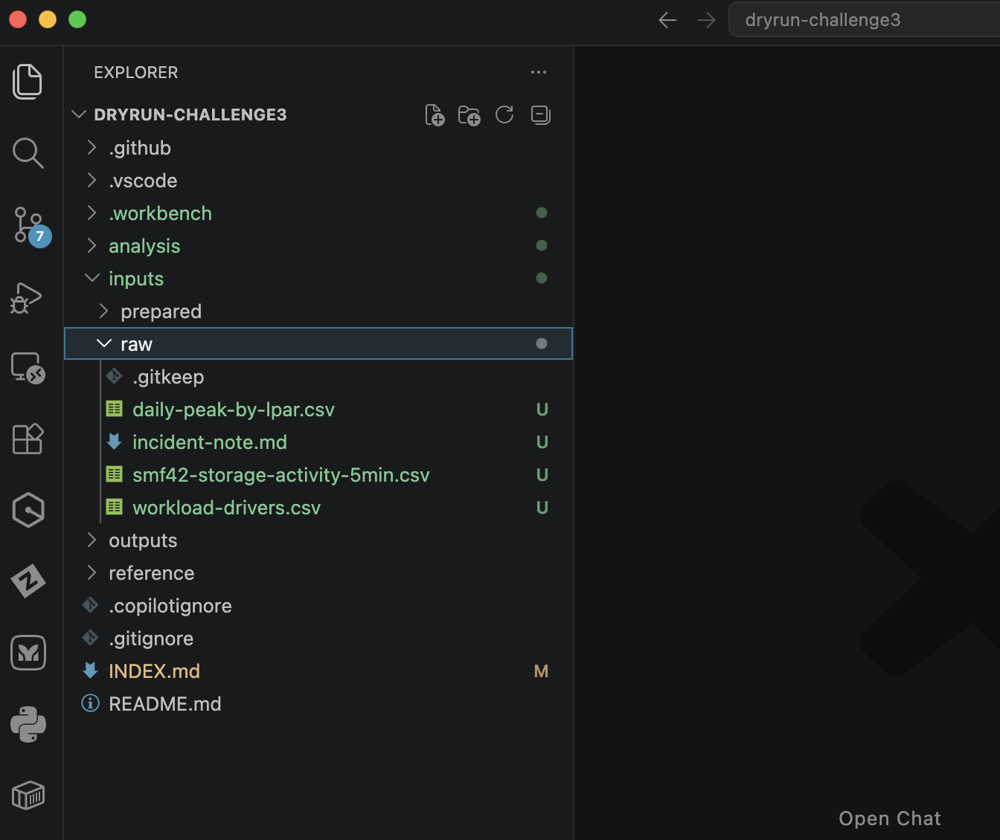
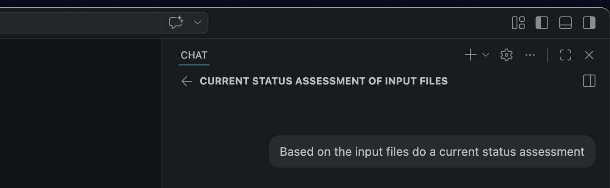

# Challenge 3 — Data-Driven Assessment

**Total working time: 45 minutes** plus 15-minute team readout.

---

## Narrative Context

The SysOps Foundation prototype is working. SkyBridge's VP of Infrastructure, James Chen, is impressed — but he has a new problem.

> *"We had a major CPU spike on April 1st that blew past our contracted MSU baseline. The CIO is asking what happened and whether it will happen again. I've pulled some performance data from our SMF records, but my team doesn't have time to analyze it. Can Kyndryl take a first pass?"*

Your team's mission: use the **Agentic Workspace** — a structured VS Code project designed for AI-assisted analysis — to analyze SkyBridge's performance data and produce a **current status assessment** that James can share with his leadership.

---

## Objective

Clone the Agentic Workspace repository, load SkyBridge's performance data, use GitHub Copilot to analyze the input files, and produce a current status assessment document.

**Expected Skill Level**: Level 3 — Designs and builds independently with minimal guidance. Extends existing patterns.

**Activity Type**: AI-assisted data analysis using GitHub Copilot in VS Code.

---

## What You Will Produce

1. A **current status assessment** generated with Copilot's help — summarizing what the data shows, what is clear, and what gaps remain
2. A **brief customer-ready presentation** (3–5 slides or a 1-page summary) that your team would send to James and his leadership

---

## Step 1: Clone the Agentic Workspace Repository (5 minutes)

The Agentic Workspace is a pre-structured VS Code project designed for AI-assisted analysis. Clone it using GitHub Desktop — the same process you used in the setup phase.

!!! danger "Do NOT clone into OneDrive"
    Choose a local folder like `~/Documents` or `~/dev`. **Never** clone a repository into a OneDrive-synced folder (e.g. `~/OneDrive`, `~/OneDrive - Kyndryl`). OneDrive file locking and syncing conflicts will corrupt your Git repository and cause build failures, missing files, and other hard-to-diagnose errors.

1. Open **GitHub Desktop**
2. Go to **File → Clone Repository** (or `Cmd+Shift+O` / `Ctrl+Shift+O`)
3. Select the **URL** tab and paste:

    ```
    https://github.com/kyndryl-global-delivery/agentic-workspace-technical-toolkit
    ```

4. Choose a **local path outside OneDrive** and click **Clone**
5. Once cloned, click **Open in Visual Studio Code**

You should see a project structure like this:



The key folders are:

| Folder | Purpose |
|--------|---------|
| `inputs/raw/` | Where you place raw data files for analysis |
| `inputs/prepared/` | Where cleaned or transformed data goes |
| `analysis/` | Where analysis outputs and notes are stored |
| `outputs/` | Where final deliverables (reports, presentations) go |
| `reference/` | Background material and context documents |

---

## Step 2: Download and Place the Input Files (5 minutes)

Download the Challenge 3 input data files from the shared folder:

:material-download: **[Download Ch3 Input Files](https://kyndryl.sharepoint.com/:f:/t/Classof2022ModernMainframeExperience-Engineering/IgCFeVqJXSjTSJ7uuhaqD5QoATfOxy3V285pOx9YTffdQlA?e=MvoIew)**

Download all files from that folder and place them in the `inputs/raw/` folder inside the Agentic Workspace.

The input files are:

| File | Description |
|------|-------------|
| `incident-note.md` | James's description of the April 1st CPU spike incident |
| `daily-peak-by-lpar.csv` | Daily peak MSU values per LPAR for the prior week + April 1 |
| `workload-drivers.csv` | Workload driver breakdown by service class (March 25–31 only) |
| `smf42-storage-activity-5min.csv` | Storage subsystem activity at 5-minute intervals |

After placing the files, your `inputs/raw/` folder should look like this:



---

## Step 3: Analyze the Data with Copilot (20 minutes)

Now use GitHub Copilot to analyze the input data and generate a current status assessment.

1. Open the **Copilot Chat** panel in VS Code
2. Prompt Copilot to analyze the input files:

    

    Example prompt:

    > *Based on the input files do a current status assessment*

3. Review Copilot's analysis. It should identify:
      - The **April 1 CPU spike** — approximately 60% above the prior week's peak
      - Which **LPARs** were most affected (SKBV01, SKBM01)
      - Patterns visible in the **March 25–31 workload drivers** (elevated batch activity, storage I/O spikes)
      - The **critical data gap** — the workload-driver file covers March 25–31 only and has **no April 1 data**

4. Save Copilot's assessment to the `analysis/` or `outputs/` folder

!!! warning "The Key Insight"
    The data is intentionally incomplete. You can see *that* April 1 spiked, but you **cannot** determine *what caused it* because the workload-driver breakdown for April 1 is not in the dataset. A strong assessment explicitly calls this out and requests the missing data.

### What a Strong Assessment Includes

- **Confirmed spike**: April 1 peak at ~312 MSU on SKBV01 vs. prior week max of ~195 MSU
- **Data gap identified**: No workload-driver rows for April 1 — cause cannot be determined from current data
- **Tentative hypothesis**: March 31 evening patterns suggest batch processing (RJES, BATDFLT service classes) may be involved, but this cannot be confirmed without April 1 data
- **Specific data request**: April 1 workload-driver data (SMF30 breakdown by service class and LPAR)

!!! tip "Red Flags to Avoid"
    If your assessment claims to know the root cause without having April 1 workload data, go back and check your work. The data doesn't support a definitive root cause — that's the point of the exercise.

---

## Step 4: Create a Customer-Ready Presentation (15 minutes)

Now produce a deliverable that James could share with SkyBridge leadership.

Create a **brief presentation or summary document** (3–5 slides or a 1-page narrative) covering:

1. **What happened** — summary of the April 1 CPU spike and its magnitude
2. **What the data shows** — key findings from the daily peak and workload driver analysis
3. **What we don't know yet** — the data gap and why it matters
4. **Recommended next steps** — specific data requests and follow-up actions

!!! tip "Use Copilot"
    Ask Copilot to help you draft the presentation. You can prompt it to create slide outlines, executive summaries, or customer-facing language. Save the output in the `outputs/` folder.

### Guidance for a Strong Deliverable

- **Be specific**: Include actual numbers from the data (MSU peaks, percentage increase, affected LPARs)
- **Be honest about gaps**: Acknowledge what the data does and does not tell you. Do not fabricate conclusions
- **Request the right data**: Name the specific record type (workload-driver / SMF30) and date (April 1) you need
- **Keep it executive-friendly**: Avoid deep technical jargon. James needs to forward this to his CIO

---

## Readout (15 minutes)

Each team presents their findings:

1. **2–3 minutes**: Walk through your current status assessment and key findings
2. **1–2 minutes**: Present your customer deliverable
3. **Discussion**: Instructor and peers provide feedback

### What the Instructor Is Looking For

| Criteria | Strong | Weak |
|----------|--------|------|
| Identified the April 1 spike | Quantified with actual MSU values and % increase | Vague or missing |
| Identified the data gap | Explicitly stated that April 1 workload drivers are missing | Not mentioned |
| Tentative hypothesis | Connected March 31 patterns to a possible batch cause | Claimed certainty without data |
| Data request | Specific: April 1 SMF30 / workload-driver data by service class | Vague: "we need more data" |
| Customer deliverable | Professional, numbers-backed, actionable | Too technical or missing key points |
