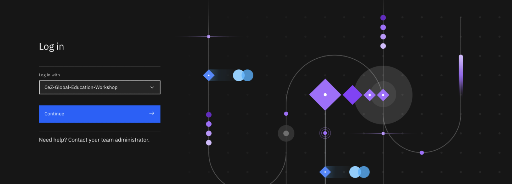
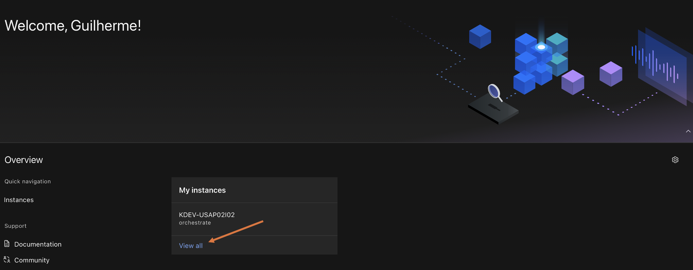
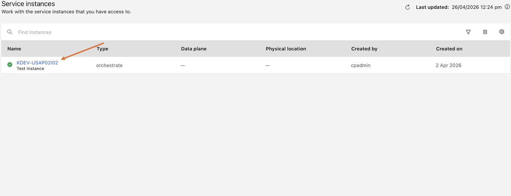
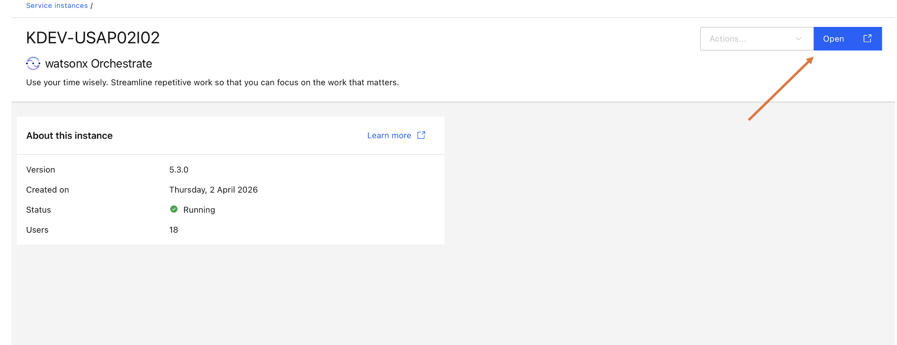
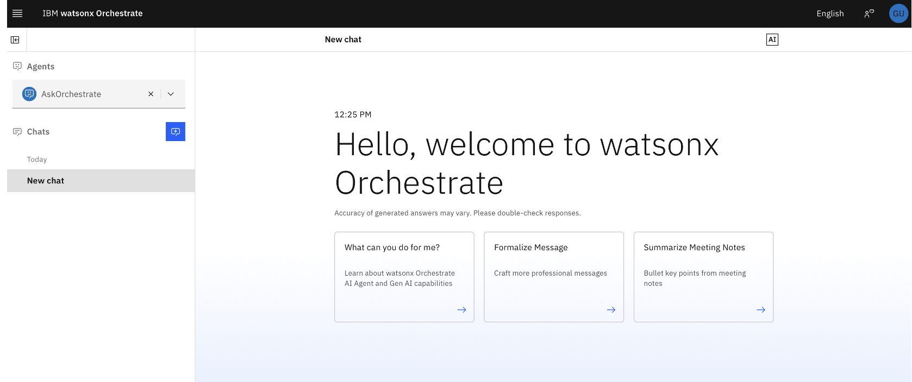

# $ setup

!!! info "This guide is updated continuously. Pull-to-refresh."
    If something looks off or out of date, ping the instructor — fixes ship live.

Complete every step **before the workshop**. Several access approvals can take 1–3 business days, so start now.

## What you'll have at the end

- GitHub Desktop signed in to the workshop GitHub enterprise
- VS Code with the required extensions and GitHub Copilot signed in
- Python 3.11+ and `uv`
- IBM Watsonx Orchestrate ADK (`orchestrate` CLI), authenticated to the workshop tenant
- VPN configured for the workshop network
- Two repos cloned locally

## Prerequisites

- Kyndryl-managed laptop (Windows 11 or macOS)
- Internet access + corporate VPN (GlobalProtect)
- Access to **Company Portal** (Windows) or **Mac@Kyndryl** (macOS)

---

## Step 0 — Request access (do this first)

These take days. Submit them now.

### 0.1 — GEMU (GitHub Enterprise Managed Users)

1. Try signing in at [GEMU_SSO_URL](https://github.com/enterprises/kyndryl-emu/sso). If you can sign in, you already have access — skip to 0.2.
2. Otherwise raise a TaaS request at [TAAS_PORTAL_URL](https://apps.powerapps.com/play/e/b59025d2-4ba4-e867-8e66-4c9dda5b6309/a/3ae7ad37-7e40-4da8-a156-d1e3053ae092?tenantId=f260df36-bc43-424c-8f44-c85226657b01):
    1. **Create New Request**
    2. Application: **GitHub Enterprise Managed Users (GEMU)**
    3. Request type: **I want to join an org**
    4. GEMU Org: **global delivery**
    5. Justification: *Participation in Mainframe Modernization Summit 2026 specialist workshop*
    6. **Submit**. Allow up to 3 business days.

### 0.2 — GitHub Copilot

GEMU access is a prerequisite. Then follow the procedure at [COPILOT_REQUEST_URL](https://kyndryl.sharepoint.com/sites/TaaSToolchainasaService/SitePages/GitHub-Copilot-for-Business.aspx). Allow up to 2 business days.

### 0.3 — Confirm Watsonx Orchestrate login

You must be on the workshop VPN gateway (**Brazil South** for the Brazil edition).

**First, update your hosts file** so your machine can resolve the workshop URLs:

=== "macOS"

    ```bash
    sudo nano /etc/hosts
    ```

    Add these two lines at the end of the file, save (`Ctrl+O`, `Enter`), and exit (`Ctrl+X`):

    ```
    146.89.19.92 cpd-cpd-instance-1.apps.ocp-prod-2-usa.agenthub.kyndryl.net
    146.89.19.92 cpd-cpd-instance-2.apps.ocp-prod-2-usa.agenthub.kyndryl.net
    ```

=== "Windows"

    1. Open **Notepad** as Administrator (right-click → *Run as administrator*).
    2. **File → Open**, navigate to `C:\Windows\System32\drivers\etc\hosts`
    3. Add these two lines at the end of the file and save:

    ```
    146.89.19.92 cpd-cpd-instance-1.apps.ocp-prod-2-usa.agenthub.kyndryl.net
    146.89.19.92 cpd-cpd-instance-2.apps.ocp-prod-2-usa.agenthub.kyndryl.net
    ```

**Then proceed:**

1. Connect VPN, select **Brazil South**.
2. Open [CPD_URL](https://cpd-cpd-instance-2.apps.ocp-prod-2-usa.agenthub.kyndryl.net/). On the login screen, select **CeZ-Global-Education-Workshop** from the dropdown and click **Continue**.

    

3. Once logged in, on the CPD home page, locate **My instances** and click the **orchestrate** instance.

    

4. On the **Service instances** page, click the instance name link (e.g. **KDEV-USAP02I02**).

    

5. On the instance details page, click **Open** (top-right). This opens the IBM Watsonx Orchestrate Welcome page.

    

6. Confirm the Watsonx Orchestrate Welcome page loads.

    

!!! warning "If you cannot log in, contact the instructor before the event — do not wait until Day 1."

---

## Pick your OS

- [macOS setup →](macos.md)
- [Windows setup →](windows.md)

When you finish OS-specific install:

- [Run the verify checklist →](verify.md)
