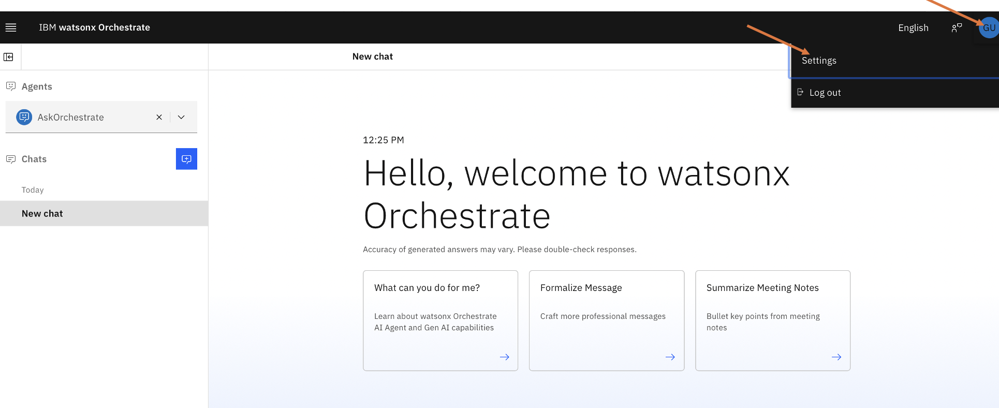
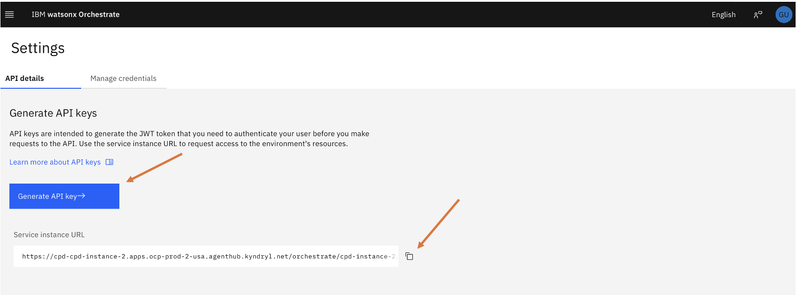
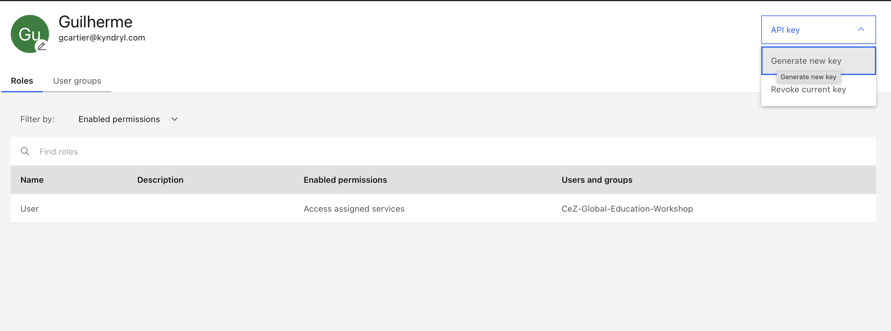
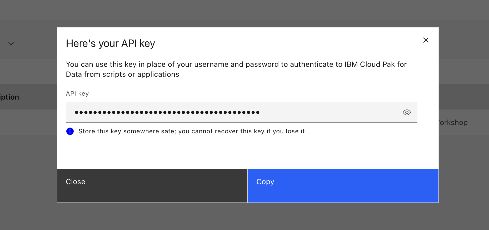

# Windows setup

!!! info "This guide is updated continuously. Pull-to-refresh."

!!! warning "Use PowerShell, not cmd.exe"
    All commands below assume **PowerShell**. Open a fresh window after each install so PATH changes take effect.

Already done [Step 0 access requests](index.md#step-0-request-access-do-this-first)? Continue.

## 1. GitHub Desktop

=== "Windows"

    1. Open **Company Portal**, search **GitHub Desktop**, click **Install**.
    2. Launch GitHub Desktop after install.
    3. If unavailable, download from <https://desktop.github.com>.

=== "macOS"

    See [macOS setup](macos.md#1-github-desktop).

### Sign in

1. First, sign in to GEMU in your browser at [GEMU_SSO_URL](https://github.com/enterprises/kyndryl-emu/sso).
2. Open GitHub Desktop → **File → Options → Accounts → Sign in** next to GitHub.com.
3. Authorize the redirect, then select the appropriate Kyndryl org when prompted.

**Verify:** your username appears top-left and *Clone a Repository* lists repos.

---

## 2. VS Code + extensions

Install VS Code from **Company Portal** (search *Visual Studio Code*) or download from <https://code.visualstudio.com/download>.

### Install extensions

1. Open VS Code.
2. Click the **Extensions** icon in the left sidebar (or press `Ctrl+Shift+X`).
3. Search for and install each of the following extensions — click **Install** for each one:

| Search for | Extension name |
|---|---|
| `Python` | **Python** (Microsoft) |
| `Pylance` | **Pylance** (Microsoft) |
| `Copilot` | **GitHub Copilot Chat** (GitHub) |
| `GitLens` | **GitLens** (GitKraken) |
| `Markdown All in One` | **Markdown All in One** (Yu Zhang) |
| `YAML` | **YAML** (Red Hat) |
| `Code Spell Checker` | **Code Spell Checker** (Street Side Software) |

### Sign in to Copilot

1. Sign in to GEMU in your browser first: [GEMU_SSO_URL](https://github.com/enterprises/kyndryl-emu/sso).
2. In VS Code, click the Copilot icon (bottom-right). If it has a slash, click and sign in.
3. Or: Ctrl+Shift+P → **GitHub Copilot: Sign In**.

**Verify:** Copilot icon has no slash. Open Chat (Ctrl+Shift+I), type `Hello`, confirm a response.

---

## 3. Python 3.11+

Check first:

```powershell
python --version
```

If `>= 3.11`, skip ahead.

**Option A — Company Portal (recommended):** install **Python**, open a new PowerShell window, run `python --version`.

**Option B — python.org:** download from <https://www.python.org/downloads/>. **Check "Add Python to PATH"** on the first screen before clicking Install Now. New PowerShell window → `python --version`.

---

## 4. uv (Python package manager)

!!! warning "Turn VPN off for installs"
    The Kyndryl VPN blocks package downloads. **Disconnect the VPN** before running install commands (`uv sync`, `uv tool install`, `pip install`, etc.). Reconnect on **Brazil South** when done.

```powershell
powershell -ExecutionPolicy ByPass -c "irm https://astral.sh/uv/install.ps1 | iex"
```

Close and reopen PowerShell, then:

```powershell
uv --version
```

---

## 5. Generate an API Key for Watsonx Orchestrate

!!! danger "VPN must be on — Brazil South"
    Reconnect the VPN to **Brazil South** before proceeding. Watsonx Orchestrate is only reachable through the VPN.

1. Log in to Watsonx Orchestrate following [Step 0.3](index.md#03-confirm-watsonx-orchestrate-login).
2. On the Welcome page, click your **user icon** (top-right corner) and select **Settings**.

    

3. In the **API details** tab, click **Generate API key**.

    

4. On the API key page, expand the **API key** dropdown and click **Generate new key**.

    

5. Copy your API key from the confirmation dialog.

    

!!! danger "Save your API key now"
    Copy and store the API key somewhere safe — you will **not** be able to see it again after closing this dialog.

Also copy the **Service instance URL** shown on this page and save it for later.

---

## 6. Clone repo and set up the environment

### 6.1 — Clone the workshop repo

!!! danger "Do NOT clone into OneDrive"
    Choose a local folder like `C:\Users\YourName\Documents` or `C:\dev`. **Never** clone a repository into a OneDrive-synced folder (e.g. `C:\Users\YourName\OneDrive`). OneDrive file locking and syncing conflicts will corrupt your Git repository and cause build failures, missing files, and other hard-to-diagnose errors.

1. **GitHub Desktop → File → Clone Repository → URL** tab.
2. URL: https://github.com/kyndryl-global-delivery/mainframe-modernization-workshop-2026-specialist
3. Local path: e.g. `C:\Users\YourName\Documents\mainframe-modernization-summit-2026`.
4. **Clone**, then **Open in Visual Studio Code**.

### 6.2 — Install dependencies

!!! warning "VPN must be off"
    Disconnect the VPN before running `uv sync`. Reconnect on **Brazil South** afterwards.

Open a terminal in VS Code (or navigate to the repo folder in PowerShell) and run:

```powershell
uv sync
```

```powershell
.venv\Scripts\Activate.ps1
```

This creates a `.venv`, installs all dependencies (including the Orchestrate ADK), and activates the environment.

!!! tip "Execution policy error?"
    If PowerShell blocks the activation script, run `Set-ExecutionPolicy -Scope CurrentUser RemoteSigned` first.

### 6.3 — Fix TLS certificate errors

Our corporate network uses a self-signed certificate chain that causes SSL errors when the Orchestrate CLI talks to the platform:

```
ssl.SSLCertVerificationError: [SSL: CERTIFICATE_VERIFY_FAILED] certificate verify failed:
self-signed certificate in certificate chain (_ssl.c:1032)
```

To fix this, we'll create a small Python script that writes a `sitecustomize.py` into the virtual environment, disabling SSL verification.

**Create a file** named `fix_tls.py` in the repo root with the following content:

```python title="fix_tls.py"
import pathlib, sysconfig

SITECUSTOMIZE = """\
import ssl, warnings, os

os.environ["PYTHONHTTPSVERIFY"] = "0"
os.environ["CURL_CA_BUNDLE"] = ""
os.environ["REQUESTS_CA_BUNDLE"] = ""

warnings.filterwarnings("ignore", message="Unverified HTTPS request")
ssl._create_default_https_context = ssl._create_unverified_context

try:
    import urllib3
    urllib3.disable_warnings(urllib3.exceptions.InsecureRequestWarning)
except ImportError:
    pass

try:
    import requests
    from requests.adapters import HTTPAdapter

    class SSLAdapter(HTTPAdapter):
        def init_poolmanager(self, *args, **kwargs):
            kwargs["cert_reqs"] = ssl.CERT_NONE
            return super().init_poolmanager(*args, **kwargs)

    _orig = requests.Session.__init__

    def _patched(self, *a, **kw):
        _orig(self, *a, **kw)
        self.verify = False
        self.mount("https://", SSLAdapter())
        self.mount("http://", HTTPAdapter())

    requests.Session.__init__ = _patched
except ImportError:
    pass
"""

target = pathlib.Path(sysconfig.get_paths()["purelib"]) / "sitecustomize.py"
target.write_text(SITECUSTOMIZE)
print(f"Written to {target}")
```

Then **run it** with the venv Python:

```powershell
.venv\Scripts\python fix_tls.py
```

You should see output like:

```
Written to C:\Users\you\...\wxa4z-challenges\.venv\Lib\site-packages\sitecustomize.py
```

!!! warning "Always use `.venv\Scripts\python`"
    Do **not** run `python fix_tls.py` — that uses the system Python, which writes to the wrong location and will fail with a `PermissionError`.

### 6.4 — Create the `orchestrate` alias

The CLI needs `PYTHONPATH` set so it picks up `sitecustomize.py`. Add a PowerShell function so you can just type `orchestrate`:

```powershell
$profileDir = Split-Path $PROFILE
if (!(Test-Path $profileDir)) { New-Item -ItemType Directory -Path $profileDir -Force }
if (!(Test-Path $PROFILE)) { New-Item $PROFILE -Force }
Add-Content $PROFILE 'function orchestrate { $env:PYTHONPATH=".venv\Lib\site-packages"; & .venv\Scripts\orchestrate.exe @args }'
```

Reload the profile:

```powershell
. $PROFILE
```

**Verify:**

```powershell
orchestrate --version
```

First line should show `ADK Version: 2.x.x` (other lines are image tags — normal).

### 6.5 — Configure and log in

!!! danger "VPN must be on — Brazil South"
    All `orchestrate` commands that talk to the platform (env add, activate, agent list, import, etc.) require the VPN connected to **Brazil South**.

```powershell
orchestrate env add -n workshop -u <SERVICE_INSTANCE_URL> --type cpd
```

```powershell
orchestrate env activate workshop
```

Replace `<SERVICE_INSTANCE_URL>` with the **Service instance URL** you copied in [Step 5](#5-generate-an-api-key-for-watsonx-orchestrate).

When prompted: enter your CPD username (Kyndryl email), enter the **API key** you've generated earlier

### 6.6 — Verify platform connectivity

```powershell
orchestrate models list
```

You should see a table of available models, for example:

```
                                 Available Models
┏━━━━━━━━━━━━━━━━━━━━━━━━━━━━━━━━━━━━━━━━━━━━━━━━━━━━━━┳━━━━━━━━━━━━━━━━━━━━━━━━━━┓
┃ Model                                                ┃ Description              ┃
┡━━━━━━━━━━━━━━━━━━━━━━━━━━━━━━━━━━━━━━━━━━━━━━━━━━━━━━╇━━━━━━━━━━━━━━━━━━━━━━━━━━┩
│ ✔◆ virtual-model/watsonx/ibm/granite-3-3-8b-instruct │ No description provided. │
└──────────────────────────────────────────────────────┴──────────────────────────┘
```

If this returns a model list, your TLS fix, alias, and platform credentials are all working. You're ready for the workshop!

---

[Run the verify checklist →](verify.md)
