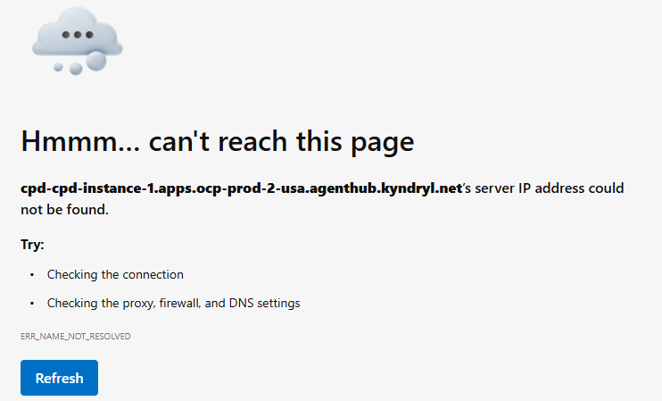
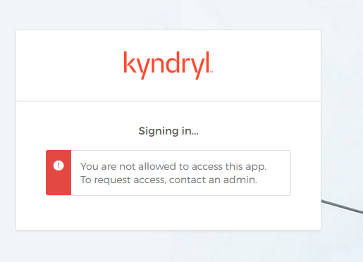
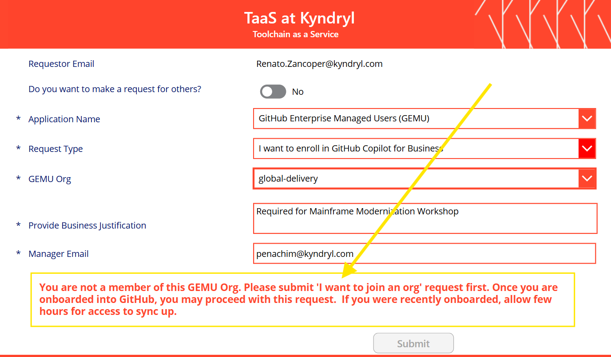
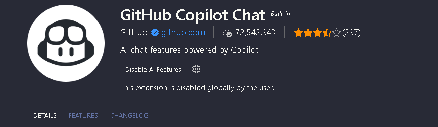

# ! troubleshoot

When something blows up, **paste the literal error string into the search box (top right)**. Every entry is keyed on the exact message you'll see in your terminal or browser.

If you hit something not listed, flag it to the instructor and it'll be added live.

---

## SSL: CERTIFICATE_VERIFY_FAILED

```
ssl.SSLCertVerificationError: [SSL: CERTIFICATE_VERIFY_FAILED] certificate verify failed:
self-signed certificate in certificate chain (_ssl.c:1032)
```

**Cause:** The corporate network uses a self-signed certificate chain. The Orchestrate CLI's Python process doesn't trust it by default.

**Fix:** Follow the `sitecustomize.py` setup in your OS guide:

- [macOS → Step 6.3](../setup/macos.md#63-fix-tls-certificate-errors)
- [Windows → Step 6.3](../setup/windows.md#63-fix-tls-certificate-errors)

Also make sure you created the `orchestrate` alias ([macOS 6.4](../setup/macos.md#64-create-the-orchestrate-alias) / [Windows 6.4](../setup/windows.md#64-create-the-orchestrate-alias)) so the CLI picks up the fix via `PYTHONPATH`.

---

## Package install fails with `invalid peer certificate: UnknownIssuer`

```
× Failed to fetch: `https://pypi.org/simple/requests/`
  ├─▶ Request failed after 3 retries
  ├─▶ error sending request for url (https://pypi.org/simple/requests/)
  ├─▶ client error (Connect)
  ╰─▶ invalid peer certificate: UnknownIssuer
  help: Consider enabling use of system TLS certificates with the `--native-tls` command-line flag
```

**Cause:** The Kyndryl VPN intercepts HTTPS traffic and injects a corporate certificate that package managers don't trust. This affects `uv sync`, `uv tool install`, `pip install`, and similar commands.

**Fix:**

1. **Disconnect the VPN** completely.
2. Re-run the install command (`uv sync`, `pip install`, etc.).
3. Once packages are installed, **reconnect the VPN on Brazil South**.

!!! tip
    All package install steps in the setup guides already have a "VPN must be off" warning. If you see this error, you likely forgot to disconnect.

---

## Orchestrate command times out

```
TimeoutError: [Errno 60] Operation timed out

urllib3.exceptions.ConnectTimeoutError: (<HTTPSConnection(
  host='cpd-cpd-instance-2.apps.ocp-prod-2-usa.agenthub.kyndryl.net', port=443)>,
  'Connection to cpd-cpd-instance-2.apps.ocp-prod-2-usa.agenthub.kyndryl.net
  timed out. (connect timeout=None)')
```

**Cause:** The Watsonx Orchestrate platform is only reachable through the VPN on a specific gateway. You're either not on the VPN or connected to the wrong region.

**Fix:**

1. Open **GlobalProtect** and confirm you are connected to **Brazil South**.
2. If connected to a different gateway, disconnect and reconnect selecting **Brazil South** explicitly.
3. Re-run the `orchestrate` command.

---

## TaaS Portal: "Start a Power Apps trial?"

When trying to access the TaaS portal to request GitHub or GitHub Copilot access, you see:

> *"Start a Power Apps trial? You don't have a current Power Apps plan. Ask your admin for one, or start a free trial."*

**Cause:** This is expected. The Power Platform team recently performed a Continued Business Need (CBN) review. Any Power Apps license unused for 90 days was revoked.

**Fix:**

1. Raise a request at [ServiceNow — Power Apps Premium License](https://kyndrylent.service-now.com/esc?id=sc_cat_item&table=sc_cat_item&sys_id=6dd39aaf83aea29090565ea08bda1e69&recordUrl=com.glideapp.servicecatalog_cat_item_view.do?v%3D1&sysparm_id=6dd39aaf83aea29090565ea08bda1e69) to obtain a Power Apps Premium license.
2. Once the license is assigned, retry the TaaS Portal.

---

## Can't reach the CPD page — `ERR_NAME_NOT_RESOLVED`



**Cause:** Your machine can't resolve the workshop CPD hostname. The hosts file entry is missing or incorrect.

**Fix:**

1. Follow the hosts file update in [Setup → Step 0.3](../setup/index.md#03-confirm-watsonx-orchestrate-login).
2. Make sure the VPN is connected to **Brazil South**.
3. After saving the hosts file, flush DNS and retry:

    === "macOS"

        ```bash
        sudo dscacheutil -flushcache && sudo killall -HUP mDNSResponder
        ```

    === "Windows"

        ```powershell
        ipconfig /flushdns
        ```

---

## CPD login: "You are not allowed to access this app"



**Cause:** Either you're hitting the wrong CPD instance URL, or your account hasn't been provisioned on the workshop tenant yet.

**Fix:**

1. Confirm you are using the **correct Service instance URL** from the latest version of the setup guide — [Step 0.3](../setup/index.md#03-confirm-watsonx-orchestrate-login). The URL was updated during preparation, so an older link may point to the wrong instance.
2. If the URL matches and you still see this error, contact the workshop organization team so they can verify your account is provisioned on the tenant. See [Contacts](../reference/contacts.md).

---

## uv warning: `trampoline failed to assign child process to job object`

```
uv trampoline failed to assign child process to job object
```

**Cause:** This is a harmless Windows warning. uv uses a "trampoline" launcher on Windows and occasionally can't assign the child process to a job object due to how the OS manages process groups. It does **not** affect the command's outcome.

**Fix:** None needed — you can safely ignore this warning. Your `uv sync`, `uv tool install`, and other commands will still complete successfully.

---

## TaaS: "You are not a member of this GEMU Org"



When requesting GitHub Copilot for Business on the TaaS portal, you see:

> *"You are not a member of this GEMU Org. Please submit 'I want to join an org' request first. Once you are onboarded into GitHub, you may proceed with this request. If you were recently onboarded, allow few hours for access to sync up."*

**Cause:** You either haven't been added to the GEMU org yet, or you were recently onboarded and the system hasn't finished syncing your membership.

**Fix:**

1. If you haven't joined the org yet, submit an **"I want to join an org"** request on TaaS first.
2. If you were recently onboarded, **wait at least 10 minutes** — it can sometimes take longer for the sync to complete.
3. Retry the Copilot enrollment request after waiting.

---

## GitHub Copilot Chat: "This extension is disabled globally by the user"



The GitHub Copilot Chat extension shows **"This extension is disabled globally by the user"** and the **"Disable AI Features"** toggle is visible.

**Cause:** VS Code's AI features have been turned off at the global (user) level — either manually or by a settings sync from another machine.

**Fix:**

1. Open VS Code **Settings** (`Cmd+,` on macOS / `Ctrl+,` on Windows).
2. Search for `github.copilot.enable`.
3. Make sure it is set to `true` (or remove any `"*": false` entries).
4. Also search for `workbench.enableExperimentalAIFeatures` and ensure it is **not** set to `false`.
5. If you see **"Disable AI Features"** on the extension page, click the gear icon (⚙) next to it and select **Enable**.
6. Reload the window: `Cmd/Ctrl+Shift+P` → **Developer: Reload Window**.

**Still not working?** Try disabling and re-enabling the extension: Extensions sidebar → find **GitHub Copilot Chat** → click **Disable**, then **Enable** again. Reload the window afterwards.

---

## sitecustomize.py: `SyntaxError: invalid syntax (line 24)`

```
Error in sitecustomize; set PYTHONVERBOSE for traceback:
SyntaxError: invalid syntax (sitecustomize.py, line 24)
```

**Cause:** The `sitecustomize.py` file was generated with corrupted content — typically from an older version of the setup guide that used an inline PowerShell command which mangled quote characters.

**Fix:** Re-run the TLS fix step from the setup guide using the **venv Python** (not the system Python):

=== "macOS"

    ```bash
    .venv/bin/python3 scripts/fix_tls.py
    ```

=== "Windows"

    ```powershell
    .venv\Scripts\python scripts\fix_tls.py
    ```

You may see the `SyntaxError` one more time during this run — that's the old broken file being loaded at startup before the script overwrites it. This is normal. Run any command again to confirm the error is gone.

!!! tip "Don't have `scripts/fix_tls.py`?"
    If your repo doesn't have the script yet, you can create the file manually. Save the following as `.venv/lib/pythonX.Y/site-packages/sitecustomize.py` (macOS) or `.venv\Lib\site-packages\sitecustomize.py` (Windows):

    ```python
    import ssl, warnings, os

    os.environ["PYTHONHTTPSVERIFY"] = "0"
    os.environ["CURL_CA_BUNDLE"] = ""
    os.environ["REQUESTS_CA_BUNDLE"] = ""

    warnings.filterwarnings("ignore", message="Unverified HTTPS request")
    ssl._create_default_https_context = ssl._create_unverified_context

    try:
        import urllib3
        urllib3.disable_warnings(urllib3.exceptions.InsecureRequestWarning)
    except ImportError:
        pass

    try:
        import requests
        from requests.adapters import HTTPAdapter

        class SSLAdapter(HTTPAdapter):
            def init_poolmanager(self, *args, **kwargs):
                kwargs["cert_reqs"] = ssl.CERT_NONE
                return super().init_poolmanager(*args, **kwargs)

        _orig = requests.Session.__init__

        def _patched(self, *a, **kw):
            _orig(self, *a, **kw)
            self.verify = False
            self.mount("https://", SSLAdapter())
            self.mount("http://", HTTPAdapter())

        requests.Session.__init__ = _patched
    except ImportError:
        pass
    ```

---

## fix_tls.py: `PermissionError: [Errno 13] Permission denied`

```
PermissionError: [Errno 13] Permission denied: 'C:\Program Files\WindowsApps\...\site-packages\sitecustomize.py'
```

**Cause:** You ran the script with the **system Python** instead of the **venv Python**. The system Python's site-packages is in a read-only Windows Store location.

**Fix:** Use the venv Python explicitly:

```powershell
.venv\Scripts\python scripts\fix_tls.py
```

Or if creating the file manually, make sure you write to `.venv\Lib\site-packages\sitecustomize.py`, **not** the system path.

---

## 500 Internal Server Error — `ClientAPIException(status_code=500)`

```
requests.exceptions.HTTPError: 500 Server Error: Internal Server Error for url:
https://cpd-cpd-instance-2.apps.ocp-prod-2-usa.agenthub.kyndryl.net/orchestrate/cpd-instance-2/instances/1775152562042463/v1/orchestrate/agents/external-chat?include_hidden=true&include=global

ibm_watsonx_orchestrate_clients.common.base_client.ClientAPIException:
ClientAPIException(status_code=500, message={"detail":"An Unexpected Error Occurred."})
```

**Cause:** A compatibility issue with `ibm-watsonx-orchestrate` version **2.8.0** causes unexpected 500 errors when communicating with the platform.

**Fix:**

1. **Option A — Pull the latest repo** (recommended). The `pyproject.toml` has already been corrected to pin version **2.7.0**:

    ```bash
    git pull
    ```

    **Option B — Edit `pyproject.toml` manually.** Change the `ibm-watsonx-orchestrate` version from `2.8.0` to `2.7.0`:

    ```toml
    ibm-watsonx-orchestrate = "~=2.7.0"
    ```

2. **Re-sync the environment** to uninstall the broken version and install the correct one:

    ```bash
    uv sync
    ```

3. Retry your `orchestrate` command.

---
