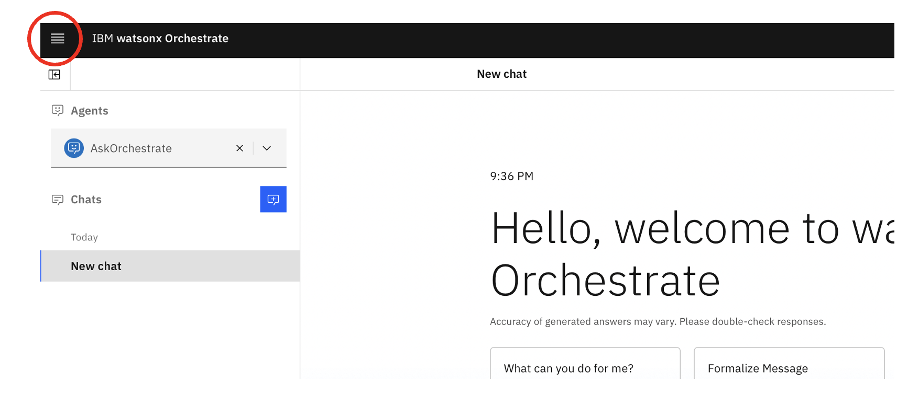
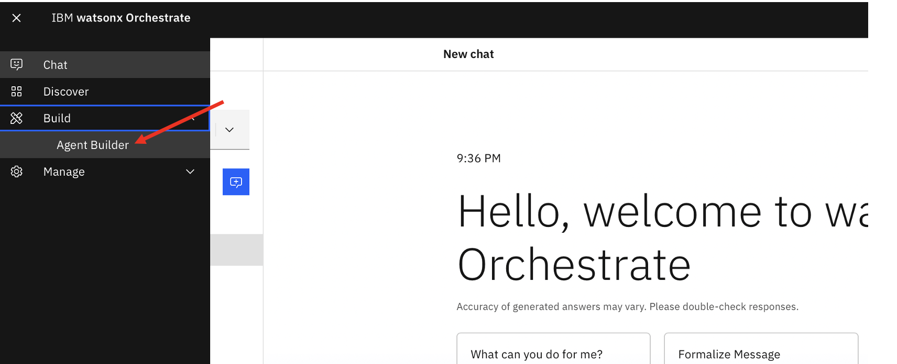
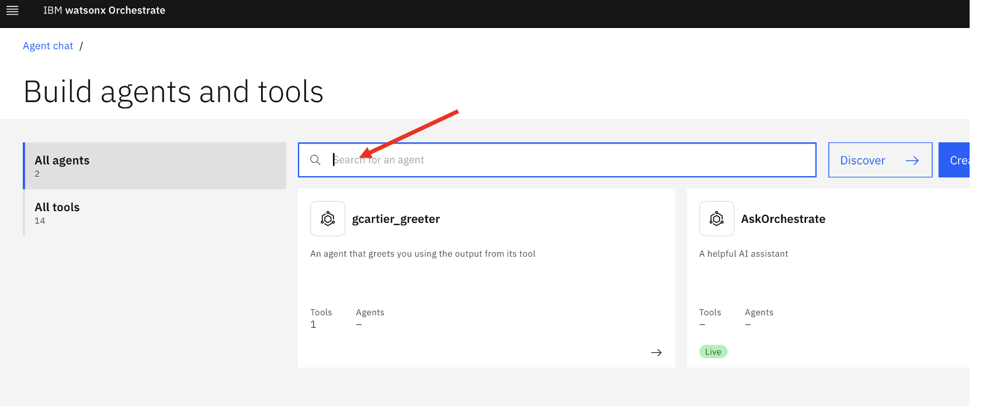
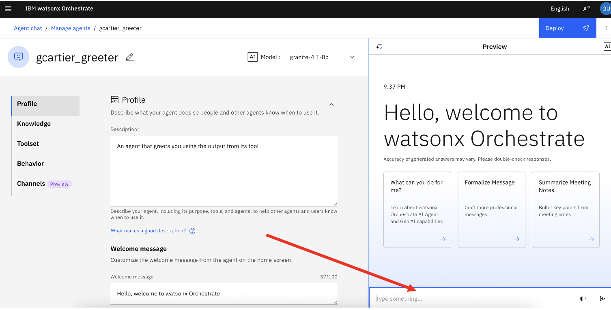

# Hello World: Your First Agent

This is a guided walkthrough based on the [official IBM tutorial](https://developer.watson-orchestrate.ibm.com/tutorials/tutorial_1_hello_world). By the end, you will have created, imported, and chatted with your first agent using the Watsonx Orchestrate ADK.

**Duration**: ~30 minutes (part of a 1.5-hour hands-on session)

---

## What You Will Build

A simple agent called **`<userid>_greeter`** that responds to the word "Greeting" by running a Python tool that returns "Hello World".

This teaches three foundational concepts:

1. **Agent definition** — a YAML file that describes what the agent does
2. **Tool** — a Python function the agent can call
3. **ADK CLI** — the commands to import and test your work

---

## Before You Begin

!!! warning "VPN Required"
    Make sure you are connected to the **GlobalProtect VPN on Brazil South**.

Activate your Watsonx Orchestrate environment:

```bash
orchestrate env activate workshop
```

---

## Naming Convention — Read This First

!!! info "Shared Environment"
    We are working in a **shared environment**. If everyone creates agents and tools with the same name, you will overwrite each other's work.

To avoid this, **prefix every agent name and tool name with your user ID** (the part before `@` in your Kyndryl email).

| Your email | Prefix | Agent name | Tool name |
|---|---|---|---|
| `gcartier@kyndryl.com` | `gcartier` | `gcartier_greeter` | `gcartier_greeting` |
| `jsmith@kyndryl.com` | `jsmith` | `jsmith_greeter` | `jsmith_greeting` |

Use this prefix consistently throughout the entire challenge.

---

## Step 1: Create the Agent Definition

Create a file called `greeter.yaml` inside the `00-hello-world/` directory with the following contents:

```yaml
spec_version: v1
kind: native
name: <userid>_greeter          # e.g. gcartier_greeter
description: An agent that greets you using the output from its tool
instructions: Always run the tool "Greeting" when the user types Greeting in the chat.
llm: virtual-model/openai/ibm-granite/granite-4.1-8b
style: default
collaborators: []
tools:
  - <userid>_greeting            # e.g. gcartier_greeting
```

!!! tip "Replace `<userid>` with your own prefix"
    See the Naming Convention above. The `llm` field must reference a model deployed in our environment — use `virtual-model/openai/ibm-granite/granite-4.1-8b`.

Key fields:

| Field | Purpose |
|-------|---------|
| `name` | Unique identifier for the agent |
| `description` | What the agent does (the LLM reads this) |
| `instructions` | Behavioral rules for the agent |
| `llm` | The language model the agent uses |
| `tools` | List of tools the agent can call |

---

## Step 2: Create the Tool

Create a `tools/` directory inside `00-hello-world/`, then create a file called `greetings.py` inside it:

=== "macOS / Linux"

    ```bash
    mkdir -p 00-hello-world/tools
    ```

=== "Windows (PowerShell)"

    ```powershell
    mkdir 00-hello-world\tools
    ```

Add the following content to `00-hello-world/tools/greetings.py`:

```python
from ibm_watsonx_orchestrate.agent_builder.tools import tool

@tool
def <userid>_greeting() -> str:   # e.g. gcartier_greeting
    """
    Greeting for everyone
    """
    greeting = "Hello World"
    return greeting
```

!!! tip "Replace `<userid>` with your own prefix"

Key concepts:

- The `@tool` decorator registers this function as a tool the agent can use
- The **function name** (e.g. `gcartier_greeting`) must match the name listed in the agent's `tools:` section
- The **docstring** is what the LLM reads to decide when to call this tool

---

## Step 3: Import the Tool

From the **root of the repository**, run:

```bash
orchestrate tools import -k python -f 00-hello-world/tools/greetings.py
```

!!! note
    All `orchestrate` commands must be run from the root of the repo.

You should see a confirmation that the tool was imported.

---

## Step 4: Import the Agent

From the **root of the repository**, run:

```bash
orchestrate agents import -f 00-hello-world/greeter.yaml
```

!!! warning
    Make sure your `greeter.yaml` has your prefixed names before importing.

You should see a confirmation that the agent was imported.

!!! failure "Getting a 500 Internal Server Error?"
    If the import fails with `ClientAPIException(status_code=500)`, this is likely caused by a version mismatch in the `ibm-watsonx-orchestrate` package. See the full fix in [Troubleshooting → 500 Internal Server Error](../troubleshooting/index.md#500-internal-server-error-clientapiexceptionstatus_code500).

---

## Step 5: Test Your Agent on Watsonx Orchestrate

After importing your agent and tool, verify that everything works by chatting with your agent directly in the Watsonx Orchestrate UI.

### 5.1 — Open the navigation menu

Click the **hamburger menu** (☰) in the top-left corner of the Watsonx Orchestrate home page.



### 5.2 — Go to Agent Builder

In the side menu, expand **Build** and click **Agent Builder**.



### 5.3 — Find your agent

On the **Build agents and tools** page, use the search bar to find your agent by name (e.g. `gcartier_greeter`).



### 5.4 — Chat with your agent

Click on your agent to open it. On the right side you will see a **Preview** panel with a chat input. Type a message (e.g. "Greeting") and press Enter to test that the agent responds correctly.



!!! success "Expected result"
    The agent should call your greeting tool and respond with **"Hello World"** (or whatever message your tool returns).

---

## Step 6: Experiment (Optional)

Try modifying the agent to deepen your understanding:

1. **Change the greeting message** — Edit `tools/greetings.py` to return something different. Re-import the tool and test again.

2. **Add a parameter** — Modify the tool to accept a `name` parameter and return a personalized greeting:

    ```python
    @tool
    def <userid>_greeting(name: str) -> str:
        """Greeting for a specific person"""
        return f"Hello, {name}! Welcome to the workshop."
    ```

3. **Update the instructions** — Change the agent's `instructions` field to trigger on different phrases.

!!! note
    After any change, you must re-import the modified artifact (`orchestrate tools import ...` or `orchestrate agents import ...`).

---

## What You Learned

| Concept | What It Means |
|---------|--------------|
| Agent YAML | Declarative definition of an agent's identity, behavior, and capabilities |
| `@tool` decorator | Turns a Python function into a tool the agent can invoke |
| `orchestrate tools import` | Registers a tool in the Watsonx Orchestrate environment |
| `orchestrate agents import` | Registers an agent in the Watsonx Orchestrate environment |

---

## Next Step

Once you are comfortable with the basics, move on to **[Connecting to z/OS: Your First Mainframe Tool](connect-to-zos.md)**.
